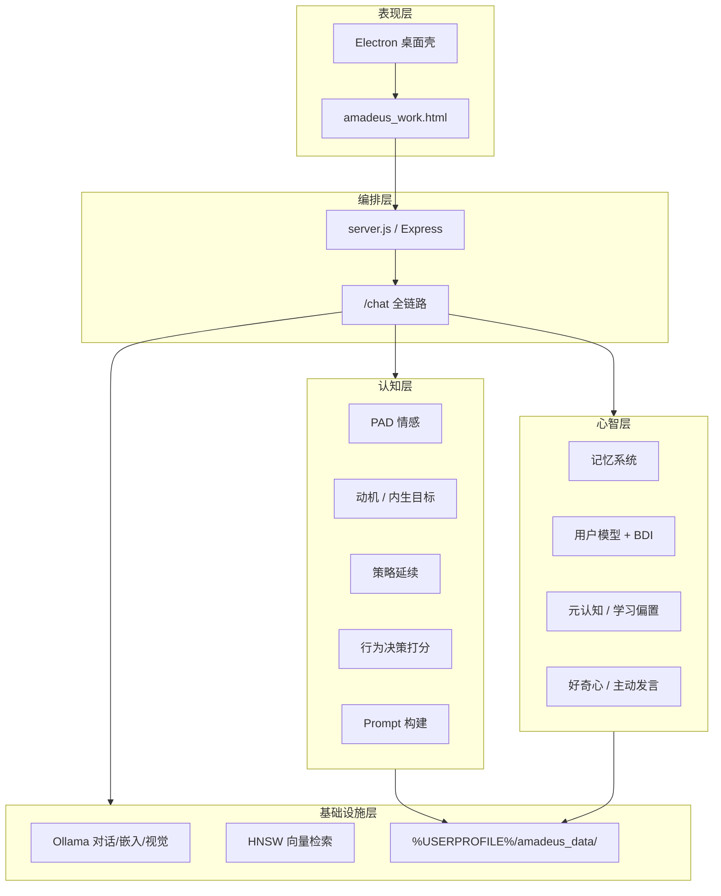
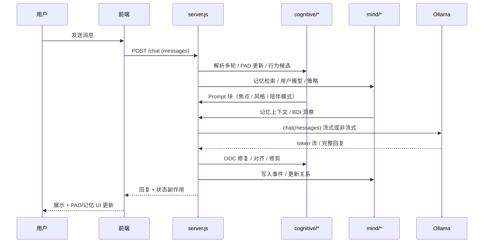

# Amadeus 产品设计说明

> 本文档描述 Amadeus 的产品定位、问题背景、差异化优势与架构设计。  
> 适用于开源 README、作品集、面试讲解与 Release 说明的补充材料。

---

## 1. 产品定位

**Amadeus 是我对「AI 伴侣」产品形态的实验性雏形（MVP Prototype）。**

它要验证的不是「模型能不能答对题」，而是：

> **在本地、私密、可长期运行的前提下，AI 能否形成「私人化、主动性、有情感连续性」的陪伴关系——而不是一次性工具调用。**

当前实现以角色化载体（牧濑红莉栖）作为人格锚点，但产品内核是**通用认知架构**：情绪状态、记忆、动机、策略、自主行为与角色一致性——可替换为其他人格或垂直场景。

---

## 2. 为什么做：时代背景与需求

### 2.1 结构性变化

在高度连接、却低质量陪伴的媒介环境里，几股力量同时抬升：

| 趋势 | 表现 |
|------|------|
| 现实关系成本上升 | 时间、情绪劳动、信任维护成本变高 |
| 精神层面需求抬升 | 倾诉、被理解、被记住、被回应——不只想「查资料」 |
| 亲密与情绪需求被压抑或延迟 | 社交羞耻、节奏错位、缺乏安全表达空间；部分人群长期处于**情感与亲密需求未被满足**的状态 |
| 数字空间成为情绪出口 | 但多数产品仍是信息流、工具或一次性对话 |

这不是「用户懒」，而是**陪伴供给形态没有跟上需求结构的变化**。

### 2.2 市面 AI 的缺口

当前主流 AI 产品大致落在两类：

| 类型 | 典型能力 | 对「伴侣」场景的不足 |
|------|----------|----------------------|
| **工具型** | 写作、编程、办公、检索 | 任务结束即关系结束；无跨会话连续性 |
| **百科全书型** | 问答、解释、总结 | 正确但疏离；难形成「这是我在对话」的私人感 |
| **角色扮演型（浅层）** | 单轮 system prompt + 人设 | 易出戏、易复读、无记忆与情绪积累；难主动 |

共性短板：

- **不够私人**：不记得你、不演化关系、不形成专属互动史  
- **不够主动**：几乎永远被动应答，缺少「她也会想起你」的时刻  
- **不够有情感**：情绪是文案表演，而非可观测、可延续的状态  

Amadeus 要补的正是这三块。

---

## 3. 产品主张（一句话）

**从「会答题的 AI」走向「会陪你过时间的 AI」——本地优先、关系连续、可感知内心状态。**

---

## 4. 核心优势（相对普通 Chatbot）

### 4.1 产品层优势

| 优势 | 用户可感知到的价值 |
|------|-------------------|
| **情感连续性** | 聊过的话会影响她接下来的语气与态度；重启后关系状态仍在 |
| **私人化** | 数据默认落本机；用户画像、whoami、记忆事件只属于这台设备上的你 |
| **主动性** | 空闲时可能主动开口，而非永远等你输入 |
| **角色一致性** | 多层防护降低「出戏、变客服、变百科全书」 |
| **可解释的「内心」** | PAD 面板、记忆宫殿、内部状态接口——关系不是黑箱 |
| **本地优先** | 不依赖云端账号体系即可运行（Ollama 本地推理） |

### 4.2 工程层优势（为什么不是 Prompt 堆砌）

| 能力 | 实现思路 |
|------|----------|
| 跨轮状态 | PAD + 策略层 + 关系强度 S，而非每轮重置 prompt |
| 长期记忆 | 事件日志 + RAG + 用户模型，按需注入而非全量塞上下文 |
| 行为选择 | 多路径候选 + 打分，而非单模板回复 |
| 用户理解 | BDI 异步推断（信念/欲望/意图），影响策略与相处方式 |
| 自主性 | 定时主动轮 + 线程连续性约束，减少「胡编话题」 |
| 质量护栏 | OOC 检测、回复修复、流式/定稿对齐、RAG 门控 |

---

## 5. 架构设计

### 5.1 总体分层

**设计原则：LLM 负责语言生成，系统负责「是谁、记得什么、现在什么情绪、打算怎么相处」。**

### 5.2 单次对话数据流（/chat）

### 5.3 认知子系统（cognitive/）

| 模块 | 职责 |
|------|------|
| `pad.js` | 愉悦度 P / 唤醒度 A / 支配度 D / 关系 S；事件推断与非线性更新 |
| `motivation.js` | 当前在意什么、害怕什么、想要什么 |
| `goals.js` | 内生目标（好奇、探索、维持关系等） |
| `strategy.js` | 跨轮策略：观察 → 信任 → 维持 → 退缩 → 深度投入 |
| `behavior.js` | 多路径行为候选 + 打分选择 |
| `prompts.js` | 人格/状态/记忆拼装进 Prompt，预算控制 |
| `chatTurns.js` | 多轮 messages 对齐 Ollama，历史裁剪 |
| `replyAlign.js` | 本轮焦点、RAG 门控、口吻修剪 |
| `companionMode.js` | 高亲密度陪伴模式 |
| `turnContinuity.js` | 主动发言后的线程承接 |
| `presence.js` | 用户在场 / 勿扰推断 |

### 5.4 心智与记忆（lib/ + 根目录引擎）

| 模块 | 职责 |
|------|------|
| `lib/memory.js` | 事件、时间线、观察、模式 |
| `user_model.js` | 用户画像、话题偏好、习惯 |
| `bdi_engine.js` | 周期性推断用户信念 / 欲望 / 意图 |
| `learning_engine.js` | 强化学习偏置、人格微演化 |
| `metacognition.js` | 自我反思、价值观一致性 |
| `autonomy_enhanced.js` | 好奇心与知识缺口 |
| `lib/oocGuard.js` | 出戏检测与兜底回复 |

### 5.5 基础设施选型

| 组件 | 选型 | 原因 |
|------|------|------|
| 推理 | Ollama 本地 | 隐私、成本可控、可离线 |
| 检索 | LangChain + hnswlib | 本地 RAG，无需云向量库 |
| 后端 | Node.js + Express | 与前端同栈，编排灵活 |
| 桌面 | Electron | 常驻、置顶、托盘，Companion 形态 |
| 数据 | 用户目录 `amadeus_data/` | 与代码仓库分离，避免污染与误提交 |

### 5.6 启动与健康检查

- `GET /health`：Ollama、对话模型、RAG 索引、TTS（可选）  
- 前端黄条：阻塞未就绪时的对话，引导用户完成环境准备  

---

## 6. 与「工具 AI」的设计取舍

| 维度 | 工具 AI | Amadeus |
|------|---------|---------|
| 优化目标 | 任务完成率、事实准确 | 关系连续性、角色稳定、陪伴感 |
| 状态 | 无状态或会话级 | 跨会话持久 PAD / 记忆 / 策略 |
| 主动性 | 无 | 有（受频率与场景约束） |
| 隐私 | 常依赖云端账号 | 本地优先，数据在用户目录 |
| 失败模式 | 答错 | 出戏、复读、情绪漂移——故有 OOC 与对齐层 |

---

## 7. 当前边界（诚实说明）

| 已具备 | 尚未具备 |
|--------|----------|
| 情感/记忆/主动/角色一致性机制 | 商业级合规与 IP 授权体系 |
| MVP 安装包与自检 | 完整首次引导向导 |
| 可观测内心状态 UI | Live2D 与情绪联动（资产在，未全接入） |
| 开源文档与测试护栏 | 云端同步、多用户、付费体系 |

---

## 8. 路线图（产品向）

1. **Phase 1（当前）**：验证「情感连续性伴侣」核心循环——对话 → 状态变化 → 记忆 → 主动  
2. **Phase 2**：体验封装——Live2D / 首启向导 / 角色探针指标化  
3. **Phase 3**：可选云同步与多设备（仍坚持隐私可选）  
4. **Phase 4**：垂直场景模板（非角色 IP 绑定的人格框架）

---

## 9. 附录：一句话对外介绍

> Amadeus 是一个本地运行的 AI 伴侣雏形：用情绪状态、长期记忆和主动行为架构，让 AI 从「工具」变成「会陪你过时间的关系」——私人、可延续、可感知。

---

## 相关文档

- 技术状态与 API：[PROJECT_STATUS.md](PROJECT_STATUS.md)
- 使用者安装：[INSTALL.md](INSTALL.md)
- 产品现状（非技术）：[MVP_STATUS.md](MVP_STATUS.md)
- 长期演进构想：[digital_life_upgrade.md](digital_life_upgrade.md)
