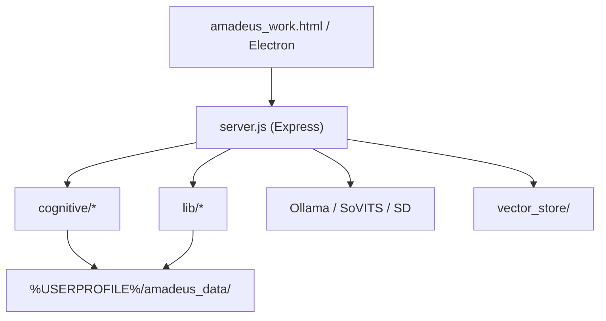

# Amadeus - Kurisu AI Companion

本项目是一个本地运行的 AI 数字伴侣系统。它不是单纯对话壳，而是在 LLM 上叠加了情绪、动机、记忆与策略层，目标是做出更有持续性的角色交互体验。

> 角色设定来源于《命运石之门》同人创作，仅用于学习与技术研究展示。

## Why This Project

- 本地优先：核心推理依赖本机 Ollama，数据默认保存在本机目录
- 认知编排：PAD 情绪、动机/目标/策略、行为决策、用户建模、记忆系统
- 多模态扩展：支持视觉输入、TTS、RAG 检索、设计任务链路
- 桌面形态：可通过 Electron 作为常驻伴侣窗口

## Features

- **多轮对话链路**：对齐 OpenAI/Ollama chat messages，保留 user/assistant 历史
- **角色一致性保护**：OOC 检测、回复修复、流式与定稿对齐
- **PAD 情绪状态**：愉悦度/唤醒度/支配度与关系强度随事件变化
- **长期记忆**：事件日志、观察、模式、关系线索，持久化到本机
- **RAG 检索**：基于 LangChain + hnswlib 的本地向量索引
- **可选能力**：摄像头视觉分析、GPT-SoVITS 语音、Stable Diffusion 设计任务

## Architecture



## Quick Start (Windows)

完整安装步骤见 **[INSTALL.md](INSTALL.md)**（给使用者）。

### 1) Prerequisites

- Node.js 18+
- Ollama (必须)
- 可选：GPT-SoVITS、Stable Diffusion WebUI

### 2) Install

```bash
npm install
```

### 3) Configure

复制 `env.example` 为 `.env`，按本机环境修改关键项：

- `AMADEUS_OLLAMA_BASE`
- `AMADEUS_SOVITS_URL` (可选)
- `AMADEUS_SOVITS_REF` (可选)

### 4) Run

```bash
npm run dev
```

浏览器访问：

- `http://localhost:3000`
- `http://localhost:3000/health`（启动自检）

或使用批处理：

- `run_backend.bat`
- `一键启动.bat`

## Electron Mode

```bash
npm start
```

Windows 安装包：

```bash
npm run release:win
```

产物在 `dist/`。发布前见 `RELEASE_CHECKLIST.md`。

## License & Notice

- [LICENSE](LICENSE) — ISC
- [NOTICE.md](../NOTICE.md) — 角色 IP 与使用边界（开源必读）

## Build RAG Index

```bash
npm run ingest
```

在修改 `brain_data/` 内容后重新执行。

## Project Structure

```text
Amadeus_Project/
  server.js
  main.js
  preload.js
  amadeus_work.html
  cognitive/
  lib/
  brain_data/
  vector_store/
  docs/
```

## Productization Roadmap

当前仓库适合作品集与开源协作，距离可售卖版本还建议补齐：

1. 最小自动化测试（纯函数 + /chat 集成）
2. CI 流水线（安装、测试、构建）
3. Electron 一体化启动后端与健康检查
4. 发布流程（版本号、变更日志、安装包验收）
5. 合规声明（隐私、第三方服务、角色 IP 边界）

## Documentation

- `MVP_STATUS.md`: MVP 产品状态说明（非技术版）
- `DESIGN.md`: 产品设计说明（背景、优势、架构）
- `PROJECT_STATUS.md`: 当前系统状态与 API 概览
- `docs/GPU_OLLAMA_SOVITS.md`: GPU/Ollama/SoVITS 调优
- `digital_life_upgrade.md`: 长期数字生命升级路线
- `README_EN.md`: English overview

## Contributing

欢迎提 Issue / PR。提交流程请见 `CONTRIBUTING.md`。

## Security & Privacy

请先阅读 `SECURITY.md`。本项目默认将运行数据写入本机用户目录，避免代码目录污染。

## License

[ISC License](LICENSE)。角色相关边界见仓库根目录 [NOTICE.md](../NOTICE.md)。
