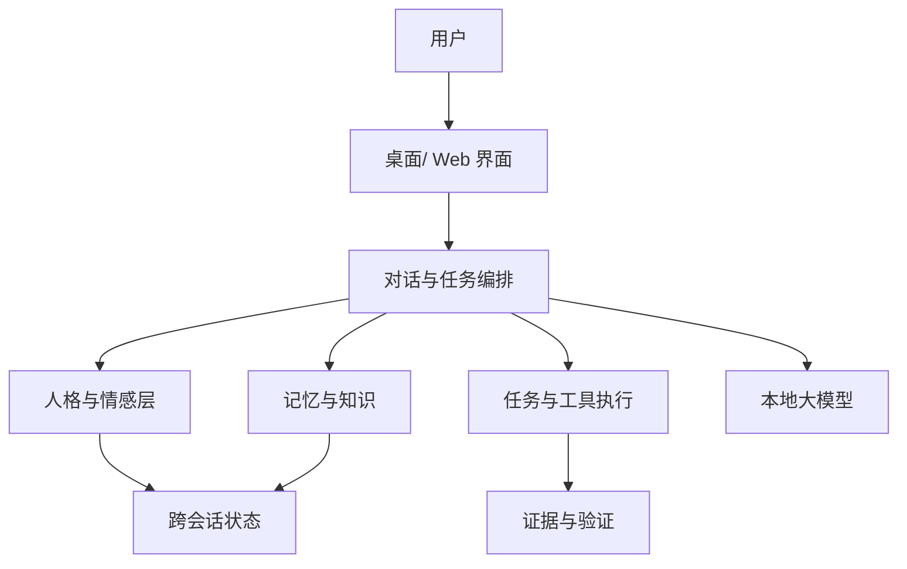

# AI 产品经理 · 两周速成计划

> **适用对象**：有 Amadeus 等 AI 产品从 0→1 经验，但不会/不必写代码，希望系统补齐 AI PM 方法论并产出可求职作品集。  
> **节奏**：第 1 周只学概念；第 2 周直接实战，全部围绕 Amadeus（或你自选的一个 AI 产品）输出交付物。  
> **原则**：每天必须有「输出物」，不能只看不写。

---

## 总览

| 周次 | 主题 | 产出 |
|------|------|------|
| **第 1 周** | 概念体系（产品 + AI + 评估 + 商业） | 概念笔记 1 份 + 自测问答 1 份 |
| **第 2 周** | 实战交付（PRD + 竞品 + 指标 + 作品集） | 可直接用于面试/求职的 AI PM 作品集包 |

---

## 第 1 周：概念密集周

**目标**：建立 AI PM 的完整 mental model——知道做什么、怎么跟工程师沟通、怎么验收 AI 功能。  
**时间建议**：每天 2～3 小时（可拆成 2 段）。  
**禁止**：第 1 周不写完整 PRD、不做大项目改动——只建立概念框架。

---

### Day 1（周一）：AI PM 是什么 + 产品基础

#### 要搞懂的概念

1. **AI PM vs 传统 PM vs Agent 工程师**
   - PM：定「做什么、为谁、怎么验收」
   - 工程师：定「怎么实现、怎么 debug」
   - AI PM 多出来的：模型能力边界、失败体验、评估指标、成本、合规

2. **产品基础四件套**
   - 用户画像（Persona）
   - 用户旅程（User Journey）
   - Jobs to be Done（用户雇这个产品完成什么「工作」）
   - MVP 切片（最小可验证版本）

3. **对照 Amadeus 读 3 份文档（30 分钟）**
   - [PRODUCT_CHARTER.md](../PRODUCT_CHARTER.md) —— 产品原则从哪来
   - [DESIGN.md](../DESIGN.md) 第 1～4 节 —— 定位与差异化
   - [MVP_STATUS.md](../MVP_STATUS.md) —— 产品现状（非技术版）

#### 今日输出

```markdown
# Day1 笔记：我用三句话描述 Amadeus

1. 为谁：
2. 解决什么：
3. 和 ChatGPT 的差异：

# 自测（用自己的话答，每题 3～5 句）
- AI PM 日常最花时间的事是什么？
- 为什么「AI 伴侣」和「工具型 Chatbot」产品逻辑不同？
```

#### 参考资源（选 1～2 个即可）

- 吴恩达 *Generative AI for Everyone* —— Week 1 前半（什么是 GenAI）
- 《启示录》第 1～3 章 或任意 PM 入门文章

---

### Day 2（周二）：LLM 与 Prompt（产品视角）

#### 要搞懂的概念

| 概念 | PM 需要知道到什么程度 |
|------|----------------------|
| Token / 上下文窗口 | 知道「对话越长越贵、越容易丢早期信息」 |
| System / User / Assistant | 知道「人设、规则、历史」分别放哪 |
| 温度（temperature） | 知道「创意 vs 稳定」的权衡，不必会调参 |
| 流式输出 | 知道对用户等待感的影响 |
| 能力边界 | 数学弱、无实时、长程一致性难、会幻觉 |

#### 产品决策题（概念练习）

- 用户要「她永远记得我说过的话」——产品上要承诺吗？风险是什么？
- 回复太长用户烦——是砍模型还是砍 Prompt 还是砍记忆注入？
- 本地 Ollama vs 云端 API——各适合什么产品承诺？

#### 对照 Amadeus

- [PROJECT_STATUS.md](../PROJECT_STATUS.md) —— 看「Prompt 构建」「多轮对话」两行
- [docs/CURSOR_AGENT_HANDOFF.md](CURSOR_AGENT_HANDOFF.md) —— 看「单一 Prompt 源」「Prompt 预算 8000」

#### 今日输出

```markdown
# Day2 概念卡（每项一句话）

- Token：
- 上下文窗口：
- 幻觉：
- 本地推理的产品优势（结合 Amadeus）：
- 本地推理的产品代价：

# 判断题（写「选 A/B/C + 理由」）
需求：用户希望角色绝不出戏。
A. 只改 system prompt
B. OOC 检测 + 修复 + 统一对话实录 + 测试探针
C. 换更大的模型
```

---

### Day 3（周三）：RAG 与记忆

#### 要搞懂的概念

**RAG 流程（背流程，不背代码）**

```
文档切分 → 向量化 → 用户提问时检索 → 拼进 Prompt → 模型生成
```

**PM 必问的 5 个问题**

1. 知识库谁维护？更新频率？
2. 检索不到时产品怎么说？（不能假装知道）
3. 要不要向用户展示引用来源？
4. 私密记忆和公开知识库要不要分开？
5. 记忆「准入规则」是什么——什么该记、什么不该记？

#### 对照 Amadeus

- [lib/memory.js 职责](../PROJECT_STATUS.md) —— 事件/时间线/观察
- [digital_life_upgrade.md](../digital_life_upgrade.md) —— 进化模块里的记忆重组
- 测试：[memoryAdmission.test.js](../tests/memoryAdmission.test.js) 的存在说明「记忆准入是产品规则」

#### 今日输出

```markdown
# Day3：RAG vs 长期记忆 vs 用户画像（对比表）

| 维度 | RAG 知识库 | 长期记忆 | 用户画像 |
|------|-----------|---------|---------|
| 存什么 | | | |
| 谁更新 | | | |
| 出错时长什么样 | | | |
| 用户能否删除 | | | |

# 场景题
用户：「你昨天说记得我讨厌香菜，今天怎么忘了？」
作为 PM，你会定义哪 3 条产品规则避免这种体验？
```

---

### Day 4（周四）：Agent、工具调用与 Butler

#### 要搞懂的概念

**Agent 最小闭环**

```
用户意图 → 规划 → 选工具 → 执行 → 看结果 → 再规划或交付
```

**PM 核心职责（不是写代码）**

- 定义**能力清单**（能做什么、不能做什么）
- 定义**权限与确认门**（什么自动做、什么必须先问用户）
- 定义**完成标准**（什么叫「做完了」——要有证据）
- 定义**失败策略**（重试几次、何时 blocked、如何通知用户）

#### 决策框架：什么时候用什么？

| 方案 | 适用 | 例子 |
|------|------|------|
| 固定规则/工作流 | 步骤确定、出错代价低 | 定时提醒 |
| RAG | 问答、解释、引用知识 | 角色设定、世界观 |
| Agent + 工具 | 步骤不确定、要操作外部世界 | 整理文件、查系统状态 |
| 微调 | 风格稳定、有大量高质量数据 | 角色口吻（可选） |

#### 对照 Amadeus

- [PRODUCT_CHARTER.md](../PRODUCT_CHARTER.md) 全文 —— **Day4 重点**，每条原则对应 Agent 产品设计
- [ROADMAP.md](ROADMAP.md) —— 管家路线与四层护城河
- [lib/butler/](../lib/butler/) —— 不用读代码，只看 [PROJECT_STATUS](../PROJECT_STATUS.md) 里 Butler 相关描述

#### 今日输出

```markdown
# Day4：Amadeus Butler 产品语言版架构（画 ASCII 或 mermaid）

用户一句话 → ??? → ??? → 证据 → 回复用户

# 宪章翻译练习：任选 PRODUCT_CHARTER 3 条，各写
- 用户能感知到的价值：
- 若违反，最坏会发生什么：
- 验收时怎么测：
```

---

### Day 5（周五）：AI 交互、信任与失败体验

#### 要搞懂的概念

1. **信任设计**：引用来源、不确定时承认、不伪造执行结果
2. **失败体验比成功更重要**：错了怎么道歉、怎么撤销、怎么让人工接管
3. **主动性边界**：什么时候可以主动开口？用户如何关闭？
4. **情感产品特有风险**：依赖、误导、未成年人、IP 合规（读 [NOTICE.md](../../NOTICE.md)）

#### 对照 Amadeus

- 主动对话：[conversationInitiative 相关测试](../tests/conversationInitiative.test.js)
- OOC / 角色一致性：[oocGuard](../tests/oocGuard.test.js)
- 情感连续性：PAD + 关系强度（[DESIGN.md](../DESIGN.md) 4.1 节）

#### 今日输出

```markdown
# Day5：失败场景清单（至少 15 条，分类）

## 检索/记忆类
1.

## 角色/OOC 类
1.

## 任务执行类
1.

## 主动行为类
1.

# 每条补一句「产品应对」（不用写代码）
```

---

### Day 6（周六）：评估、指标与质量闭环

#### 要搞懂的概念

**指标三层**

| 层 | 例子 |
|----|------|
| 业务 | 留存、会话频次、付费 |
| 产品 | 任务完成率、重试率、关主动功能比例 |
| AI 质量 | 幻觉率、探针通过率、P95 延迟、成本/千轮 |

**评估方法**

- 黄金测试集（固定 prompt + 期望行为）
- 人工打分维度（相关性、安全、角色一致、有用性）
- Bad case 回流 → 分类 → 改产品/改规则 → 回归

#### 对照 Amadeus

- [tests/](../tests/) 目录 —— 你的「产品验收体系」雏形
- [RESUME_PITCH.md](../RESUME_PITCH.md) —— 可量化指标模板（待填真实数）

#### 今日输出

```markdown
# Day6：Amadeus 质量指标表（先定指标，第 2 周再填数）

| 指标 | 定义 | 目标值 | 怎么测 |
|------|------|--------|--------|
| 角色一致性探针通过率 | | | |
| 首 token 延迟 P95 | | | |
| 无证据宣称完成率 | | 0 | |
| 用户关主动对话率 | | | |
| … | | | |

# 概念自测：什么叫「上线前检查清单」？列 10 项
```

---

### Day 7（周日）：商业、竞品与第 1 周总复盘

#### 要搞懂的概念

1. **成本结构**：API/token、算力、标注、客服、审核
2. **护城河**（读 [ROADMAP.md](ROADMAP.md) 四层表格）
3. **何时不要用 AI**：规则能搞定、错误代价极高、没有评估手段
4. **竞品分析框架**（见下文模板）

#### 今日任务

1. **拆 2 个竞品**（建议：Character.AI + 一款国内助手，如豆包/kimi/通义之一）
2. **第 1 周总复盘**

#### 今日输出

```markdown
# Day7 竞品 A / 竞品 B（各用下面模板）

## 1. 定位与用户
## 2. 核心 AI 能力（RAG/Agent/记忆/主动）
## 3. 体验亮点与槽点
## 4. 信任与失败处理
## 5. 商业模式
## 6. 若我是 PM 会改什么（3 条）

---

# 第 1 周概念自测（闭卷，40 分钟）

1. 用 2 分钟解释 RAG，并举一个 Amadeus 例子。
2. Agent 和固定工作流区别？Butler 为什么用 Agent 路线？
3. 无证据不得宣称完成——对应 ENGINEERING 还是 PRODUCT 决策？为什么？
4. 角色 AI 的三类最大风险是什么？
5. 若研发说「换更大模型就好」，PM 应如何回应？
6. 北极星指标和模型准确率有什么区别？
7. 本地优先对 PM 意味着什么取舍？
8. 画出手动验收一个 AI 功能上线的 8 步流程。

# 复盘：我最熟的 3 个概念 / 最弱的 3 个概念
```

---

### 第 1 周结束标准（自检）

- [ ] 完成 Day1～Day7 全部输出（一个 Markdown 文件即可：`docs/ai_pm_week1_notes.md`）
- [ ] 能不看资料讲清：LLM 边界、RAG、Agent、评估、失败体验
- [ ] 能用自己的话讲 Amadeus 和 ChatGPT 的产品差异（2 分钟）

---

## 第 2 周：实战交付周

**目标**：产出 **AI PM 作品集包**——可直接放 Notion/语雀/飞书，或附在求职邮件里。  
**原则**：每天交付「可给别人看的一份文档或一张图」，不是练手作废。

建议新建目录：`Amadeus_Project/docs/portfolio/`

---

### Day 8（周一）：产品定位 + 用户研究

#### 实战任务

1. 写 **《Amadeus 产品定位一页纸》**
2. 写 **2 个 Persona + 各 1 条用户旅程**（陪伴型 / 管家型）

#### 交付模板

```markdown
# Amadeus 产品定位（一页纸）

## 一句话
## 目标用户
## 核心场景（3 个）
## 非目标用户 / 非目标场景
## 与 ChatGPT / Character.AI / 系统助手的差异表
## 为什么本地优先
## 当前阶段（MVP / V2 管家）与下一步
```

#### 验收标准

- 非技术人员能读懂
- 每句主张都能对应到 [PRODUCT_CHARTER](../PRODUCT_CHARTER.md) 或 [DESIGN](../DESIGN.md) 里的真实能力
- 明确写出「不做什么」（例如：不做云端账号体系、某阶段不做手机端）

**产出路径**：`docs/portfolio/01_positioning.md`

---

### Day 9（周二）：PRD 实战（功能 1 — 主动对话）

#### 实战任务

写完整 PRD：《主动对话与在场感》（IM 节奏、空闲触发、线程承接）

#### PRD 结构（必须包含）

```markdown
# PRD：主动对话与在场感

## 1. 背景与目标
## 2. 用户故事（至少 5 条）
## 3. 功能范围（In Scope / Out of Scope）
## 4. 用户流程（含：用户关闭主动功能）
## 5. 规则与边界
   - 触发条件
   - 频率上限
   - 禁止场景（用户在忙、刚拒绝、敏感话题…）
## 6. 失败与降级
## 7. 验收标准（可测试，不给代码）
## 8. 指标（采纳率、关闭率、用户负反馈）
## 9. 依赖与风险
## 10. 里程碑（MVP / V1.1）
```

#### 对照实现（产品语言核对）

- [conversationInitiative.test.js](../tests/conversationInitiative.test.js)
- [CURSOR_AGENT_HANDOFF.md](CURSOR_AGENT_HANDOFF.md) 里 IM 节奏、`/chat/lite`

**产出路径**：`docs/portfolio/02_prd_proactive_dialogue.md`

---

### Day 10（周三）：PRD 实战（功能 2 — Butler 任务执行）

#### 实战任务

写完整 PRD：《本地任务委托与证据验证》（Butler 内核的产品版）

#### 必须写清的 PM 决策点

1. 用户怎么说才算「下委托」？
2. 哪些能力默认可用？哪些必须二次确认？
3. 什么叫「任务完成」？证据从哪来？
4. 失败重试几次？何时 blocked 并回访用户？
5. 用户如何查看任务历史、撤销、删除？

#### 对照文档

- [PRODUCT_CHARTER.md](../PRODUCT_CHARTER.md)
- [ROADMAP.md](ROADMAP.md) v2 地基

**产出路径**：`docs/portfolio/03_prd_butler_tasks.md`

---

### Day 11（周四）：竞品 + 赛道地图

#### 实战任务

1. 完成 **赛道地图**（一张图）：陪伴 AI / 角色 AI / 个人管家 / 企业 Copilot 四座标
2. 深度拆解 **3 个竞品**（建议：Character.AI、Notion AI 或 Copilot、一款国内大模型助手）
3. 写 **《Amadeus 差异化陈述》**（500 字）

#### 产出路径

- `docs/portfolio/04_competitive_landscape.md`
- `docs/portfolio/04_competitor_*.md`（可选拆分）

#### 验收标准

- 每个竞品有：能力栈判断（RAG/Agent/记忆）、信任设计、商业模式
- 差异化不是 slogan，而是 **4 条可验证的产品决策**（例如：本地、证据链、统一事件源、角色探针）

---

### Day 12（周五）：指标体系 + 上线检查清单

#### 实战任务

1. **《Amadeus 北极星指标与仪表盘》**
2. **《AI 功能上线前检查清单》**（≥30 项，分类：安全 / 角色 / 记忆 / 任务 / 性能 / 合规）

#### 北极星建议（可改，但要写理由）

| 候选 | 适合阶段 |
|------|----------|
| 有证据的任务完成率 | 管家路线 |
| 7 日留存 & 会话深度 | 陪伴路线 |
| 免重复背景继续任务的比例 | [ROADMAP](ROADMAP.md) 已写 |

#### 检查清单示例条目

- [ ] 无工具结果时不会声称「已帮你完成」
- [ ] 角色探针集回归通过率 ≥ __%
- [ ] 用户可关闭主动对话且状态持久化
- [ ] 记忆可查看/可删除路径明确
- [ ] NOTICE / 同人标注在对外材料中可见

**产出路径**

- `docs/portfolio/05_metrics_and_launch_checklist.md`

---

### Day 13（周六）：作品集整合 + 架构图（产品语言）

#### 实战任务

1. 画 **产品架构图**（mermaid，禁止堆代码文件名，用产品模块名）
2. 写 **《Amadeus 产品案例 study》**（2000～3000 字，面试用）
3. 整理 `docs/portfolio/README.md` 目录页

#### 案例 study 结构

```markdown
# Case Study：Amadeus — 从 AI 伴侣到本地智能管家

## 背景与挑战
## 用户与场景
## 关键产品决策（至少 5 个，每个：选项 / 你的选择 / 理由 / 代价）
## 方案概览（架构图）
## 如何验证质量
## 结果与数据（能填就填，不能填写「待测」）
## 反思与下一步
```

#### 架构图示例（可改）



**产出路径**：`docs/portfolio/06_case_study.md`

---

### Day 14（周日）：模拟面试 + 对外版一页纸

#### 实战任务

1. **AI PM 面试 Q&A**（30 题自答，每题 150～300 字）
2. **对外一页纸**（给 HR/非技术面试官）
3. **第 2 周总验收**

#### 必答面试题（写进文档）

1. 介绍一个你从 0 参与定义的 AI 产品（Amadeus）
2. 如何设计角色一致性验收？
3. 模型胡说怎么办？
4. 如何平衡体验与 token 成本？
5. Agent 危险操作怎么管？
6. 本地 vs 云端怎么选？
7. 主动功能用户反感怎么办？
8. 你的北极星指标为什么选这个？
9. 说一个你做过的最难产品权衡
10. 为什么你适合 AI PM 而不是工程师？

**产出路径**

- `docs/portfolio/07_interview_qa.md`
- `docs/portfolio/08_one_pager.md`

---

### 第 2 周结束标准（作品集验收）

- [ ] `docs/portfolio/` 下至少 7 份交付物齐全
- [ ] 有 2 份完整 PRD（主动对话 + Butler）
- [ ] 有竞品/赛道分析 + 差异化陈述
- [ ] 有指标与上线检查清单
- [ ] 有 Case Study + 面试 Q&A + 对外一页纸
- [ ] 全部用**产品语言**，代码文件名仅作附录引用

---

## 附录 A：AI PM 能力速查表

| 能力 | 第 1 周 | 第 2 周 |
|------|---------|---------|
| 产品基础 | Day1 | Day8 |
| LLM/Prompt | Day2 | Case Study |
| RAG/记忆 | Day3 | PRD、指标 |
| Agent/Butler | Day4 | PRD、清单 |
| 交互/信任/失败 | Day5 | PRD、竞品 |
| 评估/指标 | Day6 | Day12 |
| 商业/竞品 | Day7 | Day11 |
| 求职表达 | Day7 自测 | Day13～14 |

---

## 附录 B：推荐资源（按优先级）

### 第 1 周必看

| 资源 | 用途 |
|------|------|
| 吴恩达 *Generative AI for Everyone* | 全局概念 |
| 本项目 [PRODUCT_CHARTER.md](../PRODUCT_CHARTER.md) | Agent 产品原则范本 |
| 本项目 [DESIGN.md](../DESIGN.md) | 定位与架构（产品视角） |
| 本项目 [ROADMAP.md](ROADMAP.md) | 商业化与护城河 |

### 第 2 周参考

| 资源 | 用途 |
|------|------|
| 本项目 [RESUME_PITCH.md](../RESUME_PITCH.md) | 面试叙事角度 |
| 本项目 [MVP_STATUS.md](../MVP_STATUS.md) | 现状描述 |
| OpenAI / Anthropic 文档中的 *Best practices* | 质量与安全清单灵感 |

### 可不优先

- Transformer 数学推导、深度学习论文、LeetCode

---

## 附录 C：与工程师协作话术（概念周可先背框架）

| 场景 | PM 说法示例 |
|------|-------------|
| 要功能 | 「用户要完成 X，成功标准是 Y，失败时展示 Z，先不做 W。」 |
| 评方案 | 「这个方案上线后怎么测？探针集谁维护？bad case 谁看？」 |
| 砍 scope | 「V1 只证明证据链闭环，浏览器执行器 v3 不做。」 |
| 模型扯皮 | 「我们先定验收集通过率，再讨论要不要换模型。」 |
| 主动功能 | 「频率上限和关闭路径是 P0，生成质量是 P1。」 |

---

## 附录 D：常见问题

**Q：我不会写代码，第 2 周 PRD 怎么写验收标准？**  
A：写「可观察行为」，不写实现。例：「当未调用文件工具时，回复中不得出现『已经帮你保存』」——对应 [PRODUCT_CHARTER](../PRODUCT_CHARTER.md) 第 5 条。

**Q：Amadeus 太大，PRD 写不完怎么办？**  
A：第 2 周只写两个功能 PRD（主动对话 + Butler），其余放进 Case Study 的「关键决策」即可。

**Q：第 1 周概念不够怎么办？**  
A：不延长周数；把薄弱点记入 Day7 复盘，第 2 周写 PRD 时回头补概念。**实战会倒逼补概念。**

**Q：作品集放哪？**  
A：推荐 `docs/portfolio/` + 导出 PDF，或复制到 Notion/语雀。GitHub 仓库链接本身就是工程师协作向的证明。

---

## 启动检查（今天就可以做）

1. 新建笔记文件：`Amadeus_Project/docs/ai_pm_week1_notes.md`
2. 新建目录：`Amadeus_Project/docs/portfolio/`
3. 读完 [PRODUCT_CHARTER.md](../PRODUCT_CHARTER.md) 和 [DESIGN.md](../DESIGN.md) 前 4 节
4. 完成 Day1 输出

---

*文档版本：v1.0 · 两周节奏（第 1 周概念 / 第 2 周实战）*
