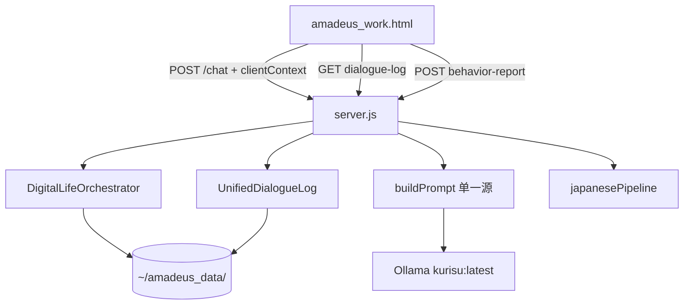

# Cursor Cloud Agent 接力文档

> **生成时间**：2026-06-25  
> **用途**：把云端 Agent 整场工程对话的上下文存到 GitHub，供本机 Cursor 打开仓库后直接接力。  
> **当前主分支**：`cursor/year1-arch-q1q4-3e20`  
> **主 PR**：[#4 第一年架构 Q1/Q4 + Phase 2](https://github.com/shishoumei829-cyber/makise-kurisu-agent/pull/4)（draft）  
> **关联 PR**：[#3 数字生命五模块](https://github.com/shishoumei829-cyber/makise-kurisu-agent/pull/3)

---

## 给本机 Cursor 的第一条消息（复制粘贴即可）

```
请阅读 Amadeus_Project/docs/CURSOR_AGENT_HANDOFF.md，按其中「待接续优先级」继续工程。
用户要求：手机端/立绘批量/云端推理先不做；其余模块按高标准深度实现，不用反复确认。
先 git checkout cursor/year1-arch-q1q4-3e20，跑 npm test，再决定下一步。
```

---

## 用户诉求演变（对话实录摘要）

### 第 1 轮：叙事不一致
- 用户指出项目从「数字生命」偏成「AI 伴侣」，README 与实现不一致。
- 要求对齐路线图与真实实现状态。

### 第 2 轮：现状与缺口
- 问数字生命路线现状与缺口。
- 要求按 `digital_life_upgrade.md` 五模块标准评估。

### 第 3 轮：逐模块深度打磨
- 要求模块一～五**不是浅骨架**，要按模块一的标准深度实现。
- 用户明确：**不用问是否继续，按高标准一一实现**。

### 第 4 轮：大工程范围划定
- **先不管手机部分**（PWA/Push/语音/Android UsageStats）。
- **立绘批量、云端推理不做**。
- 其余全部按高标准执行，Agent 自己定每模块详细计划，不用告诉用户。
- 强调：这是大工程，不要几分钟敷衍。

### 第 5 轮：测试质疑
- 用户问：「你有去测试吗」
- Agent 答复：跑了 64 项单元测试；补了 API 冒烟测试；发现并修复 `/chat` 的 `st` 未初始化崩溃。

### 第 6 轮（本条）：接力
- 用户要求：**把聊天记录展示存到 GitHub**，让本机 Cursor 接力。

---

## 已完成工作总览

### A. 数字生命五模块（PR #3，`cursor/module-01-autonomy-3e20`）

| 模块 | 路径 | 要点 |
|------|------|------|
| 一·自主性 | `digital_life/autonomy/` | 内驱力动力学、好奇心、创造性、自主行为环 |
| 二·进化 | `digital_life/evolution/` | 记忆情节重组、REM 梦境+carryover、人格轨迹、RL 桥接 |
| 三·理解 | `digital_life/understanding/` | 共情调节、心智模型、言外之意 |
| 四·具身 | `digital_life/embodiment/` | 环境/时间、PAD→表情/sprite |
| 五·元认知 | `digital_life/metacognition/` | 四域信念、反思环、洞察→目标 |
| 编排器 | `digital_life/orchestrator.js` | 五子系统统一；`afterBehaviorDecision()` 解决元认知时序 |

### B. 第一年架构 Q1/Q4（PR #4 主体）

| 项 | 实现 |
|----|------|
| 统一实录 | `lib/unifiedDialogueLog.js`；废除 `clientPersonaProvided` 双轨 |
| 单一 Prompt | 后端 `buildPrompt` 唯一源；前端 `/chat` 不传 system |
| ANCHOR 第 11 条 | 核心动机注入 `cognitive/prompts.js` |
| Prompt 预算 | 默认 **8000** 字符 |
| IM 节奏 | 同侧连续、消息队列软锁、`/chat/lite` 主动开口 |
| 日语校验 | `cognitive/japanesePipeline.js`（CN→JP 校验） |
| 六维情感 | `cognitive/innerStateSix.js` |
| 社会身份 | `cognitive/socialIdentity.js`（讲师/研究者/恋人） |
| 表达变体 | `cognitive/expressionVariants.js` |
| 行为管道 | `lib/behaviorIngest.js` + `POST /behavior-report` |

### C. Phase 2 架构深化（PR #4 最新 commit）

| 项 | 实现 |
|----|------|
| **clientContext 管道** | `lib/clientContext.js`；前端经 `POST /chat` 上报视觉/冲动/宫殿/情境 |
| **关键修复** | 此前 `_buildSystemPrompt` 被忽略 → 视觉/宫殿上下文实际丢失 |
| **实录统一** | 设计/自主/换题走 `dialogue-log/append` |
| **JP-first** | `AMADEUS_JP_FIRST=1` 可选：先日语定稿再译中文 |
| **Web 行为感知** | 页面可见性/焦点/静默 → `behavior-report` |
| **运行时 Bug** | `statePromise` 内 `st.relScore` 引用错误 → 已修（`7820454`） |

---

## 测试状态（诚实）

| 类型 | 结果 |
|------|------|
| `npm test` | **64/64 通过** |
| API 冒烟 | `/health`、`/dialogue-log/append`、`/behavior-report` ✅ |
| `/chat` + clientContext | 修 bug 后能走到 Ollama 调用；云环境无 Ollama → `fetch failed` 属预期 |
| 浏览器 UI 端到端 | ❌ 云端未做 |
| 真实 LLM 对话质量 | ❌ 需本机 Ollama + `kurisu:latest` |
| TTS / SoVITS | ❌ 未测 |

---

## Git 状态

```
主开发分支：cursor/year1-arch-q1q4-3e20（已含 PR #3 数字生命 commits）
并行分支：  cursor/module-01-autonomy-3e20 → PR #3
基础分支：  main
```

**最近 commits：**

```
7820454 fix(chat): 修复 statePromise 内 st 未初始化即引用的运行时错误
9b900c1 feat(architecture): Phase 2 深化 — clientContext、实录统一、JP-first、行为感知
538882c feat(architecture): Q1/Q4 架构大更新（不含手机/云端/立绘）
8c64e6e docs: 数字生命五大模块深度实现更新日志
```

**本机接力命令：**

```bash
git fetch origin
git checkout cursor/year1-arch-q1q4-3e20
cd Amadeus_Project
npm install
npm test
npm run dev
# 浏览器 http://localhost:3000
```

---

## 关键文件索引

```
Amadeus_Project/
├── server.js                         # 主循环、/chat、/chat/lite、新 API
├── amadeus_work.html                 # 前端：clientContext、实录同步、行为上报
├── lib/
│   ├── unifiedDialogueLog.js         # 统一实录
│   ├── clientContext.js              # ★ Phase 2 新增
│   ├── behaviorIngest.js
│   └── conversationMemory.js         # deprecated re-export
├── cognitive/
│   ├── prompts.js                    # ANCHOR 11、buildPrompt
│   ├── innerStateSix.js
│   ├── socialIdentity.js
│   ├── expressionVariants.js
│   └── japanesePipeline.js           # JP 校验 + JP-first
├── digital_life/                     # 五模块 + orchestrator.js
├── tests/                            # 64 项（含 architecture.test.js）
├── CHANGELOG.md
├── PROJECT_STATUS.md
└── docs/CURSOR_AGENT_HANDOFF.md      # 本文件
```

---

## 环境变量备忘

| 变量 | 默认 | 说明 |
|------|------|------|
| `AMADEUS_MAX_PROMPT_CHARS` | 8000 | Prompt 预算 |
| `AMADEUS_JP_VALIDATE` | 开 | 中文→日译→规则校验 |
| `AMADEUS_JP_FIRST` | 关 | 日语定稿优先（更稳、更慢） |
| `AMADEUS_JP_LLM_CHECK` | 开 | LLM 日语自检 |
| `AMADEUS_LITE_MODEL` | kurisu:latest | lite/译日模型 |
| `AMADEUS_HIGH_INTIMACY` | 1 | 高亲密度模式 |

---

## 已知局限 / 待接续优先级

### 用户明确不做
- Q2 手机（PWA/Push/语音）
- Q3 Android UsageStats 原生采集
- 立绘批量生成
- 云端推理

### 建议接续顺序

1. **合并协调 PR #3 与 #4**  
   若 `main` 合并 #3 后再合 #4，检查 `server.js` / `amadeus_work.html` 冲突。

2. **本机实机验证**（需 Ollama）  
   - 单一 prompt 是否减少 OOC（如「那还能是谁」）  
   - `clientContext` 视觉问题是否引用画面  
   - 主动开口 `/chat/lite` 是否自然  

3. **可选深化**  
   - 删除前端冗余 `_buildSystemPrompt` 死代码（已标 `@deprecated`）  
   - 统一所有 `working.push` 为实录 API（部分路径已改）  
   - JP-first 与流式体验进一步融合（当前在流式结束后跑）  
   - README 叙事与「数字生命」对齐  

4. **文档**  
   - 根 `README.md` 仍写「AI 伴侣 MVP」，与 `digital_life_upgrade.md` 叙事未统一  

---

## 云端对话原文要点（按轮）

**用户：** 项目偏成 AI 伴侣，和 README/实现不一致怎么办？  
**Agent：** 梳理数字生命五模块缺口，开始深度实现。

**用户：** 按模块一标准，其他模块也要深度做，不要浅骨架。  
**Agent：** 完成模块二～五 + 编排器 + 50→60 项测试 + PR #3。

**用户：** 手机先不管；其他按高标准自己做计划并实现，不用问我；大工程别几分钟搞定。  
**Agent：** Q1/Q4 架构 + Phase 2（clientContext、JP-first、行为感知）+ PR #4 + 64 测试。

**用户：** 你有去测试吗？  
**Agent：** 跑了单元测试 + API 冒烟；发现 `/chat` 的 `st` 未初始化 bug 并修复。

**用户：** 把聊天记录存 GitHub，我让 Cursor 接力。  
**Agent：** 写入本文件并 push。

---

## API 速查（接力调试用）

```bash
# 健康检查
curl http://localhost:3000/health

# 拉实录
curl 'http://localhost:3000/dialogue-log?limit=24'

# 行为上报
curl -X POST http://localhost:3000/behavior-report \
  -H 'Content-Type: application/json' \
  -d '{"source":"manual","note":"测试"}'

# 带 clientContext 的对话（需 Ollama）
curl -X POST http://localhost:3000/chat \
  -H 'Content-Type: application/json' \
  -d '{"messages":[{"role":"user","content":"在干嘛"}],"stream":false,"clientContext":{"vision":"他正看着屏幕","situation":"他在和你说话"}}'
```

---

## 架构简图（当前）



---

*本文档由 Cursor Cloud Agent 自动生成，随工程进展可继续追加章节。*
