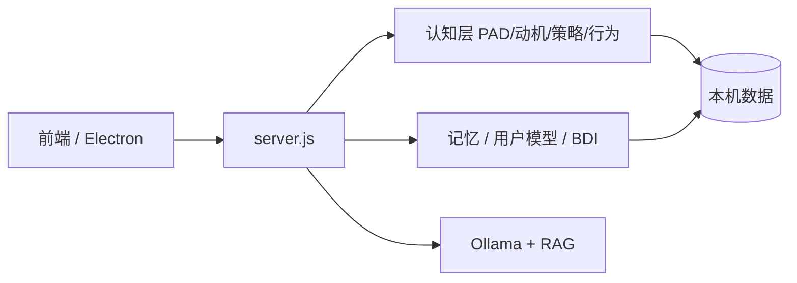

# AMADEUS System

### AI 伴侣产品雏形 ｜ 有情感连续性的本地数字陪伴

> 角色设定为《命运石之门》同人创作，仅用于学习、研究与开源展示。详见 [NOTICE.md](NOTICE.md)。


---

## 项目描述

**Amadeus 是我对「AI 伴侣」产品形态的实验性雏形（MVP）。**

在连接成本上升、精神陪伴需求抬升、部分人群情感与亲密需求长期未被满足的背景下，很多人需要的不是「更全的知识库」，而是 **私人、主动、能延续关系** 的数字存在。市面 AI 多为 **工具型**（完成任务即结束）或 **百科全书型**（正确但疏离），难以同时做到：记得你、会主动、情绪与关系随时间演化。

**Amadeus 要验证的是：**

> 在本地、私密、可长期运行的前提下，AI 能否形成 **有情感连续性的陪伴关系**，而不是一次性问答。

### 核心优势

| 维度 | 说明 |
|------|------|
| **情感连续性** | PAD 情绪 + 关系强度跨轮延续，重启后状态仍在 |
| **私人化** | 记忆、用户画像、数据默认在本机（`%USERPROFILE%/amadeus_data/`） |
| **主动性** | 空闲时可主动开口，带对话线程承接 |
| **角色一致性** | OOC 防护 + 多轮对齐，降低变客服/变百科 |
| **可观测** | 情绪面板、记忆宫殿、`/health` 启动自检 |
| **本地优先** | Ollama 本地推理，不依赖云端账号即可运行 |

### 架构概要

**LLM（Ollama）负责生成语言；认知编排层负责「是谁、记得什么、现在什么情绪、打算怎么相处」。**



完整设计说明与架构图见 **[Amadeus_Project/DESIGN.md](Amadeus_Project/DESIGN.md)**。

---

## 快速开始

主项目在 [`Amadeus_Project/`](Amadeus_Project/)。

```bash
cd Amadeus_Project
npm install
npm run dev
```

浏览器打开 `http://localhost:3000`，或阅读 [INSTALL.md](Amadeus_Project/INSTALL.md)。

Windows 安装包：见 [Releases](https://github.com/shishoumei829-cyber/makise-kurisu-agent/releases)。

---

## 文档

| 文档 | 说明 |
|------|------|
| [DESIGN.md](Amadeus_Project/DESIGN.md) | 产品设计说明（背景、优势、架构） |
| [INSTALL.md](Amadeus_Project/INSTALL.md) | 使用者安装指南 |
| [PROJECT_STATUS.md](Amadeus_Project/PROJECT_STATUS.md) | 技术状态与 API |
| [MVP_STATUS.md](Amadeus_Project/MVP_STATUS.md) | 产品现状（非技术版） |

---

## 许可证

[ISC License](LICENSE)
