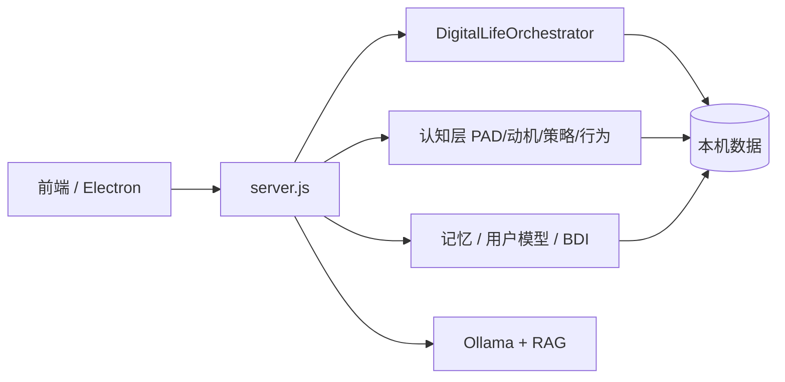

# AMADEUS System

### 本地数字生命体实验 ｜ 有情感连续性的牧濑红莉栖 AMADEUS

> 角色设定为《命运石之门》同人创作，仅用于学习、研究与开源展示。详见 [NOTICE.md](NOTICE.md)。


---

## 项目描述

**Amadeus 是对「数字生命体」路线的产品化实验**——不是一次性问答工具，也不是百科型客服，而是在本地、私密、可长期运行的前提下，验证 AI 能否形成 **有情感连续性的陪伴关系**。

在连接成本上升、精神陪伴需求抬升的背景下，很多人需要的不是「更全的知识库」，而是 **私人、主动、能延续关系** 的数字存在。Amadeus 围绕五条能力轴构建（详见 [digital_life_upgrade.md](Amadeus_Project/digital_life_upgrade.md)）：

| 模块 | 能力 |
|------|------|
| **自主性** | 内驱力、好奇心、创造性、自主行为环 |
| **进化** | 记忆重组、REM 梦境、人格轨迹、强化学习 |
| **理解** | 共情调节、心智模型、言外之意 |
| **具身** | 环境/时间感知、PAD→表情与立绘 |
| **元认知** | 信念修订、反思环、洞察→目标 |

**Amadeus 要验证的是：**

> 在本地、私密、可长期运行的前提下，数字生命能否形成 **有情感连续性的关系**，而不是一次性问答。

### 核心优势

| 维度 | 说明 |
|------|------|
| **情感连续性** | PAD 情绪 + 关系强度跨轮延续，重启后状态仍在 |
| **私人化** | 记忆、用户画像、数据默认在本机（`%USERPROFILE%/amadeus_data/`） |
| **主动性** | 空闲时可主动开口，带对话线程承接 |
| **角色一致性** | OOC 防护 + 单一 Prompt 源 + 统一对话实录 |
| **可观测** | 情绪面板、记忆宫殿、`/health` 启动自检 |
| **本地优先** | Ollama 本地推理，不依赖云端账号即可运行 |

### 架构概要

**LLM（Ollama）负责生成语言；认知编排层 + 数字生命五模块负责「是谁、记得什么、现在什么情绪、打算怎么相处」。**



完整设计说明与架构图见 **[Amadeus_Project/DESIGN.md](Amadeus_Project/DESIGN.md)**。工程接力与待办见 **[CURSOR_AGENT_HANDOFF.md](Amadeus_Project/docs/CURSOR_AGENT_HANDOFF.md)**。

---

## 快速开始

主项目在 [`Amadeus_Project/`](Amadeus_Project/)。

```bash
cd Amadeus_Project
npm install
npm run dev
```

浏览器打开 `http://localhost:3000`，或阅读 [INSTALL.md](Amadeus_Project/INSTALL.md)。

Windows 安装包：见 [Releases](https://github.com/shishoumei829-cyber/makise-kurisu-agent/releases)。

---

## 文档

| 文档 | 说明 |
|------|------|
| [DESIGN.md](Amadeus_Project/DESIGN.md) | 产品设计说明（背景、优势、架构） |
| [INSTALL.md](Amadeus_Project/INSTALL.md) | 使用者安装指南 |
| [PROJECT_STATUS.md](Amadeus_Project/PROJECT_STATUS.md) | 技术状态与 API |
| [CURSOR_AGENT_HANDOFF.md](Amadeus_Project/docs/CURSOR_AGENT_HANDOFF.md) | 云端 Agent 对话摘要与接力待办 |
| [AI_PM_LEARNING_PLAN.md](Amadeus_Project/docs/AI_PM_LEARNING_PLAN.md) | AI 产品经理两周学习路径（第 1 周概念 / 第 2 周实战） |
| [MVP_STATUS.md](Amadeus_Project/MVP_STATUS.md) | 产品现状（非技术版） |

---

## 许可证

[ISC License](LICENSE)
